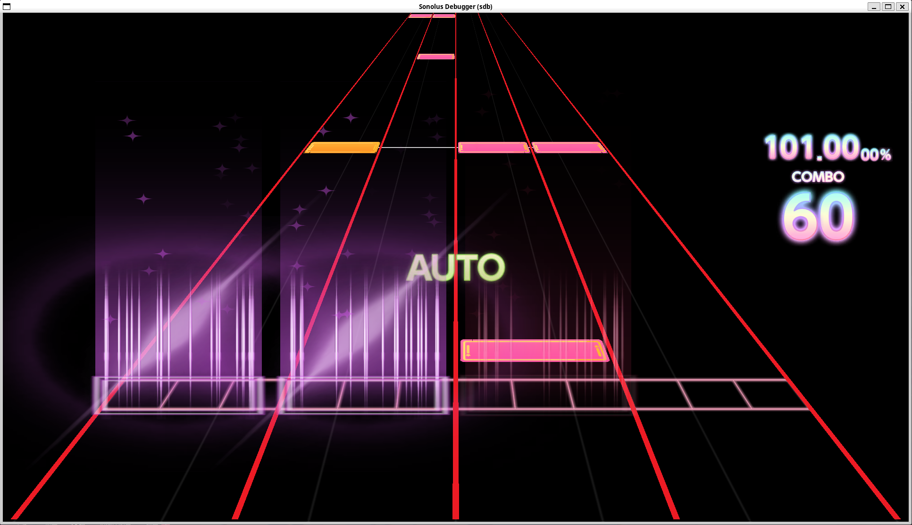

# Sonolus Debugger / Simulator (sdb)

> [!WARNING]  
>
> **This project is Work In Progress(WIP)**

> [!NOTE]
>
> **Check passed on engine [`sirius`](https://github.com/SonolusHaniwa/sonolus-sirius-engine), [`phigros`](https://github.com/SonolusHaniwa/sonolus-phigros-engine), [`next-sekai`](https://github.com/Next-SEKAI/sonolus-next-sekai-engine), [`next-rush`](https://github.com/UntitledCharts/sonolus-next-rush-engine), [`snake`](https://github.com/LBO44/Sonolus-Snake-Engine)**

> [!IMPORTANT]
>
> **Only play, watch and tutorial mode was implemented, and there still exists some functions are not implemented.**

## Dependencies

```bash
sudo apt install libgl-dev libglfw3-dev libx11-dev libjsoncpp-dev zlib1g-dev libpng-dev libglew-dev libreadline-dev -y
```

## Generate Headers from Runtime

> [!WARNING]  
>
> **Only use these programs when Sonolus updates their runtime-metadata.**
>
> **Currently sdb has already generated headers from runtime-metadata for Sonolus v1.1.4**

Download runtime-metadata from <https://github.com/Sonolus/runtime-metadata>.

Compile programs:

```bash
g++ function_generator.cpp -o a.out -ljsoncpp -O3
g++ blocks/block_generator.cpp -o blocks/a.out -ljsoncpp -O3
```

Generate headers:

```bash
./a.out ./Function.json ./functions
./blocks/a.out ./blocks/PlayBlock.json ./blocks/Play.h Play 
./blocks/a.out ./blocks/WatchBlock.json ./blocks/Watch.h Watch 
./blocks/a.out ./blocks/TutorialBlock.json ./blocks/Tutorial.h Tutorial 
```

## Main Application

Compile application:

```bash
g++ main.cpp -omain -ljsoncpp -lz -lpng -lGL -lglfw -lGLEW -lreadline -O3
```

Usage:

```bash
Usage: ./main [--help] [--version]
              --mode <play|watch|tutorial>
              [[--config config.json]|[--input-directory data]]
              [--key-mapping key.json] [--breakpoints breakpoints.json]
              [--width 1920] [--height 1080]
              [--engine-data EngineData] [--engine-rom EngineRom]
              [--engine-configuration engine.json]
              [--level-data LevelData]
              [--skin-data SkinData] [--skin-texture SkinTexture]
              [--particle-data ParticleData]
              [--particle-texture ParticleTexture]
              [--disable-command] [--disable-gui] [--use-x11]

This is Sonolus debugger/simulator (sdb)

Optional arguments:
  -h, --help                          shows help message and exits 
  -v, --version                       prints version information and exits 
  -m, --mode <play|watch|tutorial>    select mode for Sonolus simulator. [required]
  -c, --config config.json            specify the configuration file. 
  -i, --input-directory data          specify the working directory. 
  -k, --key-mapping key.json          specify the key mapping file. 
  -b, --breakpoints breakpoints.json  specify the breakpoints file. 
  --width                             specify the width of the window [nargs=0..1] [default: 1920]
  --height                            specify the height of the window [nargs=0..1] [default: 1080]
  --engine-data EngineData            specify the engine data file. 
  --engine-rom EngineRom              specify the engine rom file. 
  --engine-configuration engine.json  specify the engine configuration file. 
  --level-data LevelData              specify the level data file. 
  --skin-data SkinData                specify the skin data file. 
  --skin-texture SkinTexture          specify the skin texture file. 
  --particle-data ParticleData        specify the particle data file. 
  --particle-texture ParticleTexture  specify the particle texture file. 
  --disable-command                   disable interactive command line. 
  --disable-gui                       disable GUI. 
  --use-x11                           use X11 to render window.
```

config.json(Take phigros engine as an example):

```json
{
    "window": {
        "width": 1920,
        "height": 1080
    },
    "engine": {
        "play": "data/Phigros/EnginePlayData",
        "watch": "data/Phigros/EngineWatchData",
        "tutorial": "data/Phigros/EngineTutorialData",
        "rom": "",
        "config": "data/Phigros/config.json"    // Generated from config-app
    },
    "level": {
        "data": "data/Phigros/LevelData"
    },
    "skin": {
        "data": "data/Phigros/SkinData",
        "texture": "data/Phigros/SkinTexture"
    },
    "particle": {
        "data": "data/Phigros/ParticleData",
        "texture": "data/Phigros/ParticleTexture"
    }
}
```

key.json(The value of key should be the macro value in <https://www.glfw.org/docs/latest/group__keys.html>):

```json
[
    {
        "key": 65,  // GLFW_KEY_A
        "x": -1,
        "y": -0.8
    },
    {
        "key": 83,  // GLFW_KEY_S
        "x": -0.3,
        "y": -0.8
    },
    {
        "key": 75,  // GLFW_KEY_K
        "x": 0.3,
        "y": -0.8
    },
    {
        "key": 76,  // GLFW_KEY_L
        "x": 1,
        "y": -0.8
    }
]
```

breakpoints.json:

```json
{
    "codes": [
        0               // Break at the code id = 0
    ],
    "memories": [
        [ 10000, 0 ]    // Break when the value in block 10000 with offset 0 was set
    ],
    "functions": [
        "Set"           // Break when `Set` function was called
    ]
}
```

Interactive command line:

```
List of classes of commands:

c, continue:
    Continue to run the engine.
q, quit, exit:
    Quit Sonolus Debugger.
show [blockId]:
    Check the values in block [blockId].
showActive:
    Show active entities.
showQueue:
    Show current entity spawn queue.
showCode [codeId] [deep = 2] [paramOff = 0] [paramLim = 16]:
    Show the code tree with [codeId] as root and limit the max deep of the tree is [deep = 2] and only show the param in [paramOff = 0] ~ [paramLim = 16].
get [blockId] [offset]:
    Get the value in block [blockId] with [offset].
set [blockId] [offset] [value]:
    Set the value in block [blockId] with [offset] to [value].
info:
    Get the information of the current entity.
switch [entityId]:
    Switch to entity [entityId] to check data in this entity.
b, breakpoint code [add/del] [codeId]:
    [add/del] a breakpoint to break the debugger at the code [codeId].
b, breakpoint memory [add/del] [blockId] [offset]:
    [add/del] a breakpoint to break the debugger when the value in block [blockId] with [offset] was set.
b, breakpoint function [add/del] [func]:
    [add/del] a breakpoint to break the debugger when `[func]` function was called.
b, breakpoint list:
    List current breakpoints.
skip [time]:
    Skip to [time].
h, help:
    Show this help information
```

GUI:



# config-app

See [config-app](./config-app/README.md)