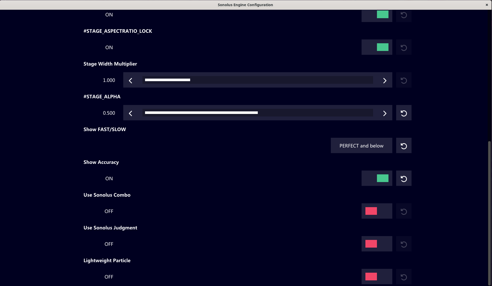

# Sonolus Engine Configuration Application

Install Dependencies:

```bash
sudo apt install libgl-dev libglfw3-dev libx11-dev libjsoncpp-dev zlib1g-dev -y
```

Compile:

```bash
g++ config.cpp -oconfig -lGL -lglfw -lX11 -ljsoncpp -lz -O3
```

Usage:

```bash
./config EngineConfiguration config.json
```

Preview:

